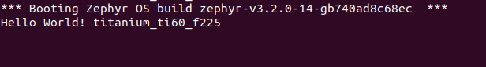

This is a guide for setting up the development environment for the Efinix FPGA to develop Zephyr project
==================================================

Prerequisites
--------------

Before proceeding with the setup, ensure that the following software are installed on your computer:

For all platforms:
- Visual Studio Code (https://code.visualstudio.com/)
- Docker Desktop (https://www.docker.com/products/docker-desktop)

For Windows:

- Ubuntu 22.04.2 LTS (https://apps.microsoft.com/store/detail/ubuntu-22042-lts/9PN20MSR04DW)
- usbipd-win 2.4.1 (https://github.com/dorssel/usbipd-win/releases/download/v2.4.1/usbipd-win_2.4.1.msi)
- Git (https://git-scm.com/downloads)

Setup
------

1. Clone the repository to your local machine:

    - Launch VS Code and Clone the repository to your local machine:
    - Open the Command Palette by pressing `Ctrl + Shift + P`
    - Type `"Git: Clone"` and hit enter
    -  Enter the current URL of the repository and hit enter
    - Choose the directory where you want to clone the repository and hit enter
    - When prompted, click on the "Open" button

2. Install recommended VS Code extensions

    - Open the Command Palette, Type `"Extensions: Show Recommended Extensions"` and hit enter
    - Install all the recommended extensions shown in the list on top left corner of the screen

3. Build the Docker image:

    - Open the Command Palette and type `docker build image`

    - Tag the image as `efinix/zephyr:latest` and wait for the build process to complete.

4. Start and Connect to the container:

    - Click on the "Remote Explorer" extension icon on the left sidebar.
    - Click on "Open Folder In Container"
    - Select the current folder/directory (cloned repo)
    - Wait for the container to start and load the workspace
    - You may be asked to `Reload Window` to complete the setup. Click on `Reload Window` to complete the setup

5. Initial setup of the development environment:

    - Open the terminal in VS Code, In the command palette, type `Terminal: Create New Terminal (In Active Workspace)` and hit enter
    - Execute the following commands:
        - `cd /zephyr`
        - `./zephyr_efx_setup.sh` --> This script will pull the Zephyr project repo with Efinix board support

- **The development environment Zephyr project with Efinix support is ready. You can now start developing and testing your project**

USBIP Setup for Windows:
------------------------
1. Launch terminal as run as administrator
2. Run `usbipd list` --> This command will list all the USB devices connected to the host machine, note down the BUS ID of the development board, it should be something like `Titanium Ti60F225 Development Kit`
3. Run `usbipd wsl attach -b <BUS ID> --distribution Ubuntu-22.04` --> replace <BUS ID> with the actual BUS ID of the development board

Development Process
--------------------
1. Obtain the Efinix Sapphire RISC-V SoC bitstream, either by using the pre-configured one or by generating a configurable one yourself

2. Obtain the zephyr firmware by running the script `./build` in the `/zephyr/zephyr` directory to build a sample "hello world" project

3. Combine both the bitstream and firmware, and flash the resulting image

4. Verify that everything went smoothly by checking the serial console, where you should see the message "Hello World!" It should look like in the image shown below

 

